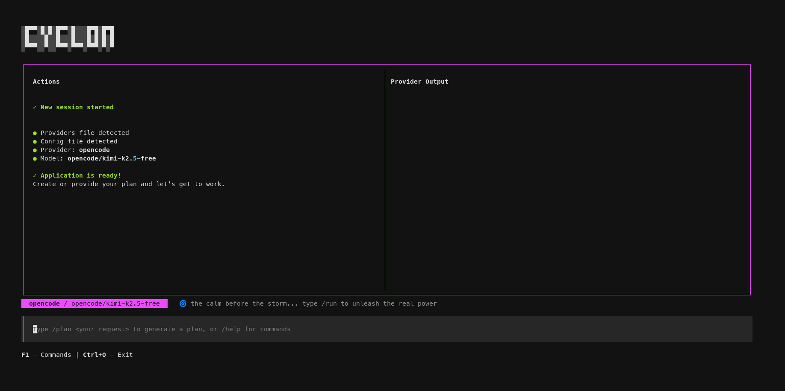

# Cyclon

**Orchestrate AI agents to execute complex coding workflows with a terminal UI.**

Cyclon is a powerful TUI-based AI automation tool that takes your work plan and executes it step-by-step using your preferred AI provider. Define your checklist, select your AI model, and let Cyclon handle the rest - with automatic retries, error handling, and real-time progress tracking.



## ✨ Features

- **Plan-Driven Execution** - Create a checklist of tasks and watch them get executed one by one
- **Multi-Provider Support** - Use OpenCode, GitHub Copilot, or add your own AI provider
- **Intelligent Error Handling** - Automatic retries with configurable exception matching
- **Live Terminal Output** - Watch AI actions in real-time with split-panel interface
- **Context Awareness** - Maintains project context across iterations for smarter execution
- **TUI Interface** - Beautiful terminal UI built with Textual
- **Per-Project Config** - Each project can have its own settings and plans

## 🚀 Quick Install

```bash
curl -fsSL https://raw.githubusercontent.com/iam-sayco/cyclon/2.x/install.sh | bash
```

Or with wget:

```bash
wget -qO- https://raw.githubusercontent.com/iam-sayco/cyclon/2.x/install.sh | bash
```

This will automatically detect and use `pipx` (recommended) or `pip` to install the latest version from GitHub.

## 📋 System Requirements

- **Python**: 3.9 or higher
- **Operating System**: Linux, macOS, or Windows (with WSL recommended)
- **Terminal**: Supports ANSI colors and Unicode characters
- **Dependencies**: Automatically installed via pip/pipx

## Installation

### Development Mode (Recommended for contributors)

```bash
# Activate virtual environment
source .venv/bin/activate

# Install in editable mode
pip install -e .
```

### Production/Distribution Mode

```bash
pipx install .
```

For detailed development instructions, see [CONTRIBUTING.md](CONTRIBUTING.md).

## 🚀 Quick Start

```bash
cyclon
```

Or run as Python module:

```bash
python -m cyclon
```

### Workflow

1. **Configure provider and model** (first-time only)
   - Press `/provider` to select AI provider (opencode, copilot)
   - Press `/model` to set the model name

2. **Create or generate a plan**
   - Press `/plan` to edit existing plan or `/plan <prompt>` to generate one
   - Or manually create `.cyclon/plan.md` with checklist of steps

3. **Add optional context**
   - Press `/prompt` to add additional instructions (coding standards, conventions, etc.)
   - Saved to `.cyclon/prompt.md`

4. **Execute**
   - Press `/run` to start execution
   - Press `/stop` to stop processing

### Detailed Usage Examples

#### Example 1: Generate and Execute a Plan

```bash
# Start Cyclon
cyclon

# In Cyclon TUI:
# 1. Configure provider (if not already done)
/provider
# Select: opencode

# 2. Set model
/model
gpt-4

# 3. Generate a plan
/plan Create a Python script that fetches weather data from OpenWeatherMap API and displays it in the terminal

# 4. Review the generated plan (saved to .cyclon/plan.md)
/plan

# 5. Add context (optional)
/prompt
# Type: Use requests library, handle API errors gracefully, format output nicely

# 6. Execute the plan
/run

# 7. Monitor progress in the terminal output panel
# 8. Stop if needed
/stop
```

#### Example 2: Manual Plan Creation

```bash
# Create .cyclon directory and plan file manually
mkdir -p .cyclon
cat > .cyclon/plan.md << 'EOF'
# Weather App Implementation

## Implementation Steps

- [ ] Install required dependencies (requests)
- [ ] Create main.py with argument parsing
- [ ] Implement API client class
- [ ] Add error handling for network issues
- [ ] Create formatted output display
- [ ] Add tests
- [ ] Update README with usage instructions
EOF

# Start Cyclon
cyclon

# Execute the plan
/run
```

#### Example 3: Adding Context

```bash
# Create context file with coding standards
cat > .cyclon/prompt.md << 'EOF'
Coding Standards:
- Follow PEP 8 style guide
- Use type hints for all function signatures
- Write docstrings in Google format
- Handle all exceptions gracefully
- Log errors with appropriate severity
- Use pathlib instead of os.path
- Prefer f-strings for string formatting
EOF

# Start Cyclon and execute
/run
```

## Available Commands

Press F1 or type `/help` to see all commands in the TUI:

| Command | Description | Usage |
|---------|-------------|-------|
| `/plan` | View/edit plan or generate new with prompt | `/plan` (view/edit) or `/plan <prompt>` (generate) |
| `/run` | Execute the plan | `/run` - starts execution with current configuration |
| `/stop` | Stop current process | `/stop` - terminates running process gracefully |
| `/prompt` | Edit additional context | `/prompt` - opens editor for context/instructions |
| `/clear` | Clear output window | `/clear` - clears terminal and log panels |
| `/new-session` | Clear all session data except config | `/new-session` - removes plan, prompt, lock files |
| `/model` | Set AI model | `/model` or `/model <model-name>` |
| `/provider` | Select AI provider | `/provider` - opens provider selection modal |
| `/help` | Show available commands | `/help` or F1 key |

### Command Details

#### `/plan [prompt]`

The plan command is the heart of Cyclon. It either:
- **Without argument**: Opens the plan editor (opens `.cyclon/plan.md`)
- **With argument**: Generates a new plan using the AI provider

Example:
```
/plan Create a REST API with Flask that manages a todo list
```

The generated plan will be saved to `.cyclon/plan.md` as a markdown checklist.

#### `/run`

Executes the current plan using the configured AI provider. This will:
1. Validate configuration (provider and model)
2. Check if plan.md exists
3. Build execution prompt from templates
4. Start the AI provider process
5. Stream output to the terminal panel
6. Monitor for exceptions and retry if needed
7. Save results to context.md for tracking

#### `/stop`

Immediately stops the current process. Useful when:
- The AI is going in the wrong direction
- You need to modify the plan mid-execution
- Something is taking too long

#### `/prompt`

Opens an editor for additional context. This is where you can specify:
- Coding standards and conventions
- Project-specific requirements
- Architecture decisions
- Any additional instructions for the AI

Content is saved to `.cyclon/prompt.md` and included in execution prompts.

#### `/new-session`

Clears all session data except configuration. This removes:
- `.cyclon/plan.md`
- `.cyclon/prompt.md`
- `.cyclon/process.lock`
- `.cyclon/context.md`
- Any other temporary files

Configuration (`.cyclon/config.json`) is preserved.

#### `/model [model-name]`

Sets or displays the AI model. Examples:
```
/model              # Shows model selection modal
/model gpt-4       # Sets model to gpt-4
/model claude-3    # Sets model to claude-3
```

#### `/provider`

Opens a modal to select the AI provider. Available providers are defined in the packaged `providers.json`. Current options include:
- **opencode**: OpenCode with configurable models
- **copilot**: GitHub Copilot (requires authentication)

#### `/clear`

Clears both the terminal output and log panels. Useful for:
- Starting fresh after errors
- Reducing visual clutter
- Preparing for new execution

## Supported Providers

- **opencode**: OpenCode with configurable models
- **copilot**: GitHub Copilot (model must be selected in copilot interactive mode)

## Configuration

Configuration uses a two-layer system:

1. **Default config** (packaged with app): `cyclon/data/config.json`
2. **User config** (per project): `.cyclon/config.json` (overrides defaults)

User config can contain:
- `provider`: AI provider to use ("opencode" or "copilot")
- `model`: Model name (e.g., "gpt-4", "claude-3-opus")
- `exceptionStrings`: List of strings to trigger retry on
- `sleep`: Sleep duration between retries (seconds, default: 10)
- `timeout`: Timeout for provider commands (seconds, default: 3600)

## Runtime Files

### Packaged with Cyclon (read-only)

- `cyclon/data/config.json`: Default configuration
- `cyclon/data/providers.json`: Available providers and their command templates
- `cyclon/data/logo.md`: ASCII logo
- `cyclon/data/prompts/execute.md`: Prompt template for plan execution
- `cyclon/data/prompts/generate.md`: Prompt template for plan generation

### User files (in your project directory)

- `.cyclon/config.json`: User configuration (overrides defaults)
- `.cyclon/plan.md`: Your work plan with checkboxes
- `.cyclon/prompt.md`: Additional context/instructions
- `.cyclon/process.lock`: Lock file (created at startup, removed on stop)
- `.cyclon.context.md`: Optional context file with error info and project structure

## Development

We welcome contributions! Please see [CONTRIBUTING.md](CONTRIBUTING.md) for detailed guidelines on:
- Setting up development environment
- Code style and conventions
- Writing tests
- Submitting pull requests

For build and distribution instructions, see [CONTRIBUTING.md](CONTRIBUTING.md).

### Architecture

Cyclon follows a layered architecture with clear separation of concerns:

- **UI Layer**: Textual-based widgets and screens (CyclonApp)
- **Service Layer**: Business logic (ConfigService, FileService, ProcessService)
- **Domain Layer**: Models, exceptions, validation, and state management
- **Infrastructure Layer**: File system and process management

See [ARCHITECTURE.md](ARCHITECTURE.md) for detailed architecture documentation.

### Quick Development Setup

```bash
# 1. Clone the repository
git clone https://github.com/iam-sayco/cyclon.git
cd cyclon

# 2. Create virtual environment
python -m venv .venv
source .venv/bin/activate  # On Windows: .venv\Scripts\activate

# 3. Install in development mode
pip install -e ".[dev]"

# 4. Install pre-commit hooks
pre-commit install

# 5. Run tests
pytest

# 6. Start development
python -m cyclon
```

### Code Quality Tools

We use several tools to maintain code quality:

```bash
# Format code
black .

# Lint and fix issues
ruff check . --fix

# Type checking
mypy cyclon/

# Run tests with coverage
pytest --cov=cyclon --cov-report=html
```

### Running Tests

Cyclon includes a comprehensive test suite using pytest.

**Install test dependencies:**
```bash
pip install -e ".[dev]"
```

**Run all tests:**
```bash
pytest tests/
```

**Run tests with coverage:**
```bash
pytest tests/ --cov=cyclon --cov-report=html
```

**Run specific test file:**
```bash
pytest tests/test_services_integration.py -v
```

**Run tests matching pattern:**
```bash
pytest tests/ -k "config"
```

Current test coverage includes:
- ConfigService - configuration management
- FileService - file operations
- ProcessService - process management with PTY support

## Project Structure

```
cyclon/
├── cyclon/              # Package source
│   ├── __init__.py     # Package exports
│   ├── cli.py          # Entry point
│   ├── app.py          # CyclonApp (main TUI)
│   ├── widgets.py      # Textual widgets
│   ├── screens.py      # Modal screens
│   ├── config.py       # Configuration manager
│   ├── constants.py    # Constants
│   ├── paths.py        # File paths
│   └── data/           # Runtime data
│       ├── config.json
│       ├── providers.json
│       ├── logo.md
│       └── prompts/
├── pyproject.toml      # Package configuration
├── ARCHITECTURE.md     # Architecture documentation
├── CONTRIBUTING.md     # Development guidelines
└── README.md           # This file
```

## License

MIT
